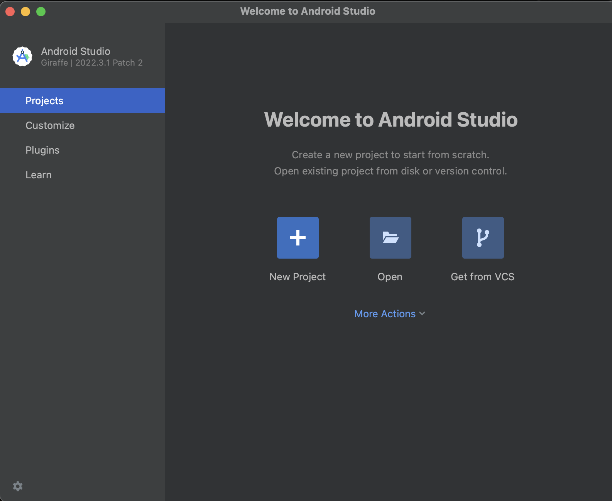
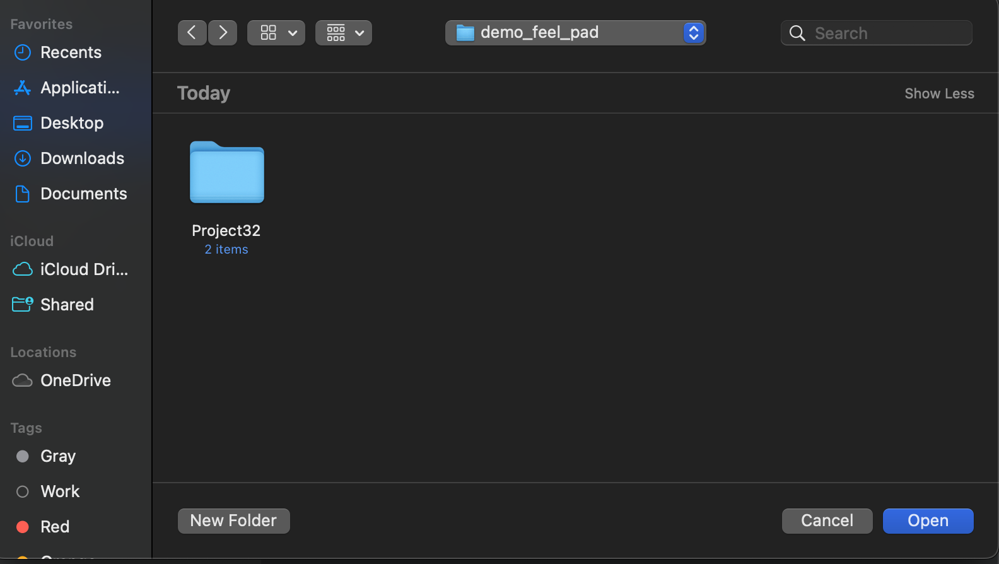
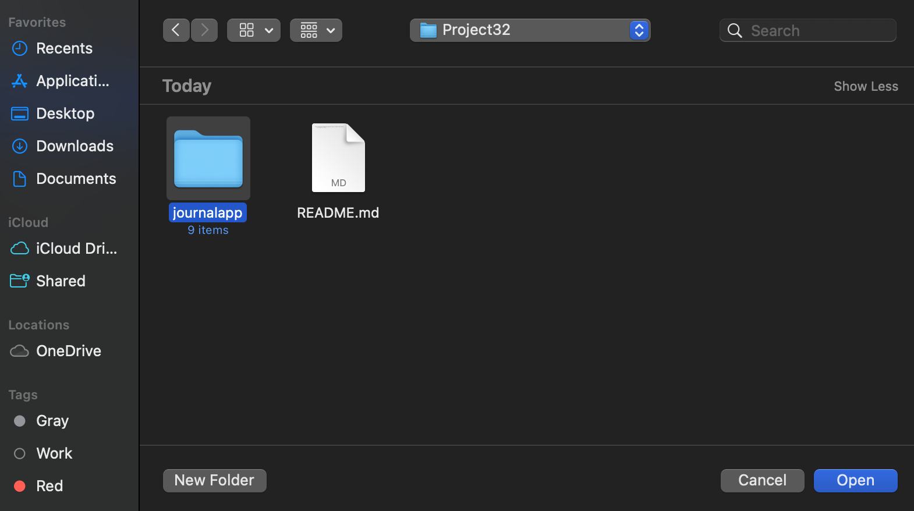
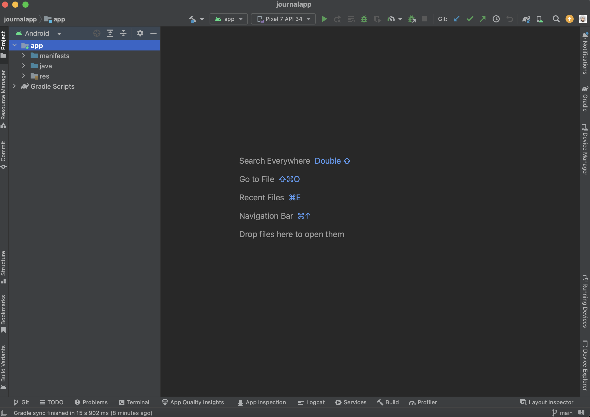
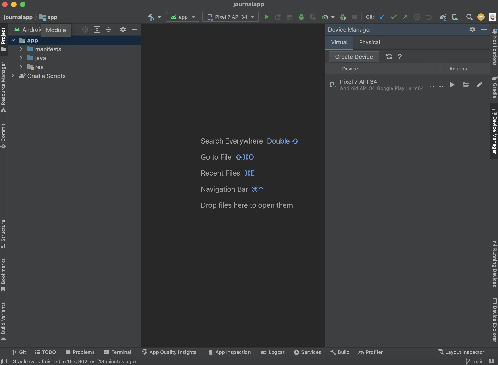

1. First clone the git repository into your choice of folder on your device.
> - use command "[git clone https://git.cs.usask.ca/team-32/Project32.git]" 

2. Project32 installation process on android studio
>   

3. How to make an emulator
> - Click on Device Manager on the write side of the window
> - Click on Create Device

