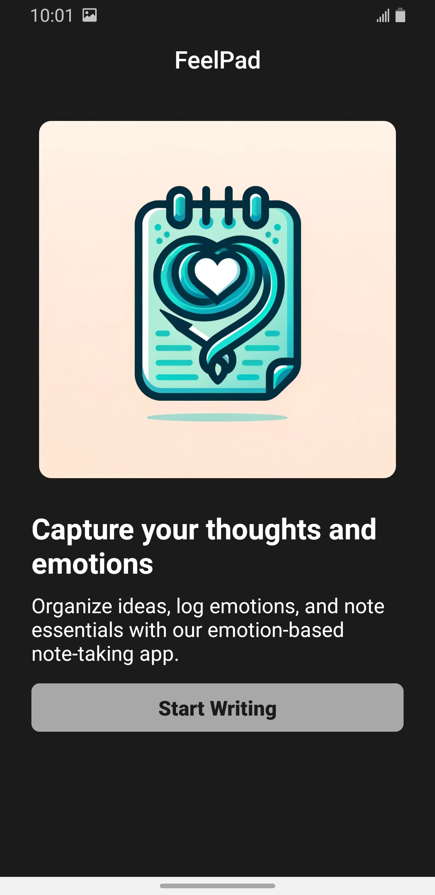
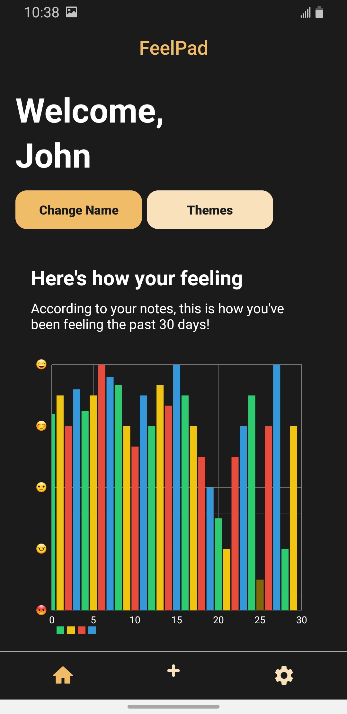
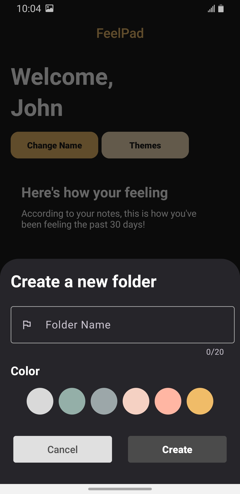
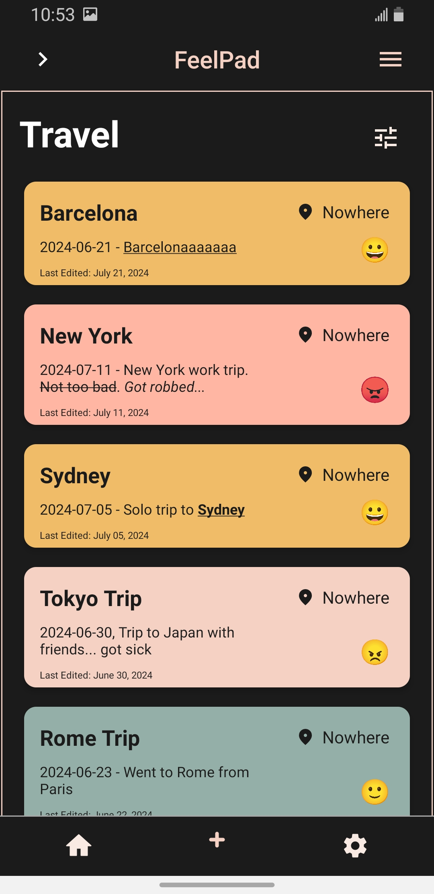
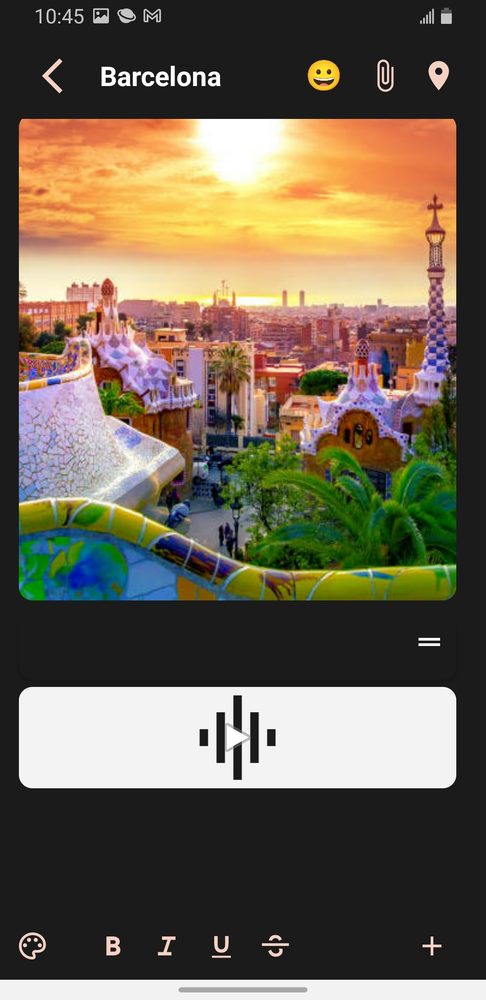

## FeelPad
FeelPad is an Android application developed for emotion-based journaling. It allows users to track their emotions and provides mood-calming themes and backgrounds, alongside features found in modern note applications. Users can also export their notes into a time-based journal for easy review.

## Features

* Google Material Design
* Multimedia note integration (photos, videos, voice)
* Emotional state tracking
* Location tagging for travel journals
* Custom templates & interface customization
* Light & Dark Theme Support
* Search, sort, and filter tools
* Note export to PDF

## Download
Get the app from our [releases page](https://github.com/lecegues/FeelPad/releases) 

## Screenshots
|  |            |     |
| ------------------------------------------------------ | ----------------------------------------------------------------------- | -------------------------------------------------------------------- |
|    |  |  |

## Credits
- Alex Liu (dal200)
- Bowen Zheng (boz321)
- Connor Schulte (nyg894)
- John Lecegues (dbj592)
- Kanwar Pannu (eza147)
- Nathan Tsandelis (nmt643)
- Saima Moonsat (cyn510)
